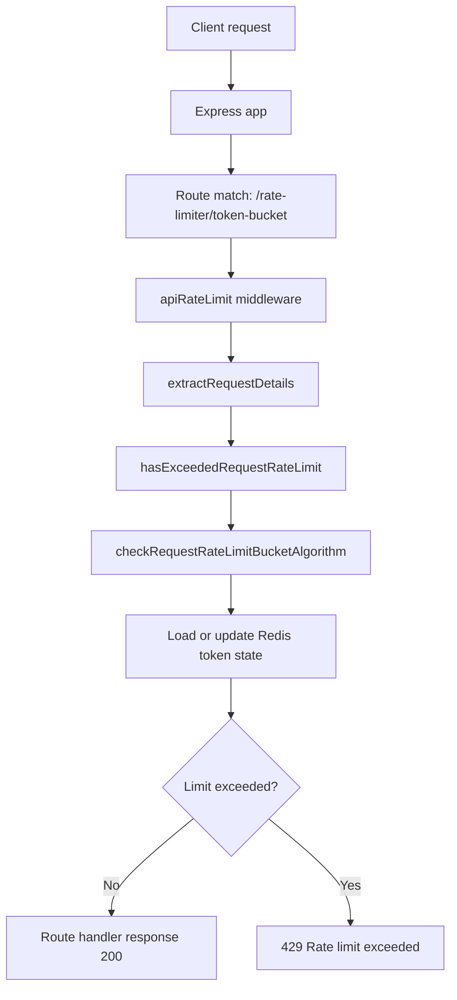

# Rate Limiting

## Overview

This project is a minimal Express-based rate limiter backed by Upstash Redis.
It currently exposes one health endpoint and one active rate-limited endpoint:
`GET /rate-limiter/token-bucket`.

When the server starts, it logs the registered routes to the console so the
active API surface is visible immediately.

## Features

- Express server written in TypeScript
- Upstash Redis integration for token-bucket state
- Startup route logging
- Token-bucket middleware for `GET /rate-limiter/token-bucket`
- Centralized error mapping for rate-limit failures

## Prerequisites

- Node.js `22+`
- npm
- Upstash Redis credentials

## Environment Variables

Create a `.env` file in the project root.

| Variable | Required | Description |
| --- | --- | --- |
| `PORT` | No | Port used by the Express server. Defaults to `3000`. |
| `NODE_ENV` | No | Runtime environment. Defaults to `development`. |
| `UPSTASH_REDIS_REST_URL` | Yes | Upstash Redis REST URL. |
| `UPSTASH_REDIS_REST_TOKEN` | Yes | Upstash Redis REST token. |

Example:

```env
PORT=3000
NODE_ENV=development
UPSTASH_REDIS_REST_URL=example
UPSTASH_REDIS_REST_TOKEN=example
```

Important:
The Redis client is initialized during app startup, so valid Upstash values are
required before the server can boot successfully.

## Install and Run

```bash
npm install
npm run dev
```

Production-style local run:

```bash
npm run build
npm run start
```

## Available Scripts

| Script | Description |
| --- | --- |
| `npm run dev` | Start the app with `tsx watch`. |
| `npm run build` | Compile TypeScript to `dist/`. |
| `npm run typecheck` | Run TypeScript without emitting files. |
| `npm run start` | Start the app with `tsx`. |

## Current Routes

| Method | Path | Description |
| --- | --- | --- |
| `GET` | `/health` | Basic service health endpoint. |
| `GET` | `/rate-limiter/token-bucket` | Token-bucket rate-limited endpoint. |

## Startup Route Logging

At startup, the app logs the route list from `APP_ROUTES`:

```text
Server listening on http://localhost:3000 using express
Registered routes:
GET /health
GET /rate-limiter/token-bucket
```

## Token-Bucket Rate Limiter

The current rate-limiter implementation protects `GET /rate-limiter/token-bucket`.

Successful requests return a JSON payload similar to:

```json
{
  "ip": "::1",
  "service": "rate-limiter",
  "framework": "express",
  "algorithm": "token-bucket",
  "route": "/rate-limiter/token-bucket",
  "status": "ok"
}
```

When the limit is exceeded, the middleware returns:

```json
{
  "error": "Rate limit exceeded."
}
```

with HTTP status `429`.

Current request flow:

1. The Express app mounts the rate-limiter router at `/rate-limiter`.
2. `GET /rate-limiter/token-bucket` matches the router handler.
3. `apiRateLimit` middleware runs before the route response.
4. Request details are extracted from the incoming Express request.
5. The token-bucket config is looked up for the route and method.
6. Redis usage state is loaded and updated.
7. The request either continues to the handler or returns `429`.

## Architecture

### Active Folder Responsibilities

- `src/conf`
  Route constants and rate-limit configuration.
- `src/routes`
  Express route registration.
- `src/middleware`
  Request interception before route handlers.
- `src/helpers/rate-limiter`
  Rate-limit orchestration and token-bucket logic.
- `src/lib`
  Redis access layer and other infrastructure adapters.
- `src/utils`
  Request-detail extraction and error utilities.

### Request Flow Schema



### Architecture Walkthrough

- `src/index.ts` loads config, starts the server, and prints the registered
  routes at boot.
- `src/express-server.ts` defines the global health route and mounts the
  rate-limiter router at `/rate-limiter`.
- `src/routes/index.ts` exposes the active token-bucket endpoint and returns
  metadata for successful requests.
- `src/middleware/rate-limiter/bucket-algorithm.ts` performs the rate-limit
  check and converts domain errors into HTTP responses.
- `src/helpers/rate-limiter/index.ts` selects the active rate-limit algorithm.
- `src/helpers/rate-limiter/bucket-algorithm.ts` contains the token-bucket
  Redis read/write flow.
- `src/lib/redis.ts` is the Upstash Redis adapter used by the algorithm.

## Current Implementation Notes

- Redis is initialized eagerly, so valid Upstash environment variables are
  required at startup.
- IP extraction is not fully centralized: `getIpAdressFromRequest()` exists in
  middleware helpers, while `extractRequestDetails()` reads `request.ip`
  directly.
- `HttpMethod` currently includes `"QUERY"`, which is not a standard HTTP
  method.
- Redis key handling is asymmetrical: `getRedisValue()` prefixes keys
  internally, while `setRedisValue()` expects the caller to pass the final key.
- `src/lib/bullmq.js` and `src/types/bucket-algorithm.ts` currently exist as
  unused or incomplete artifacts.
