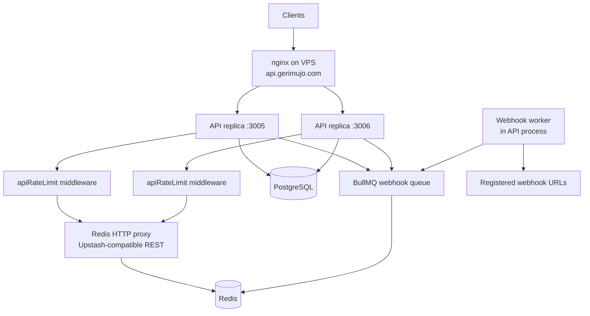
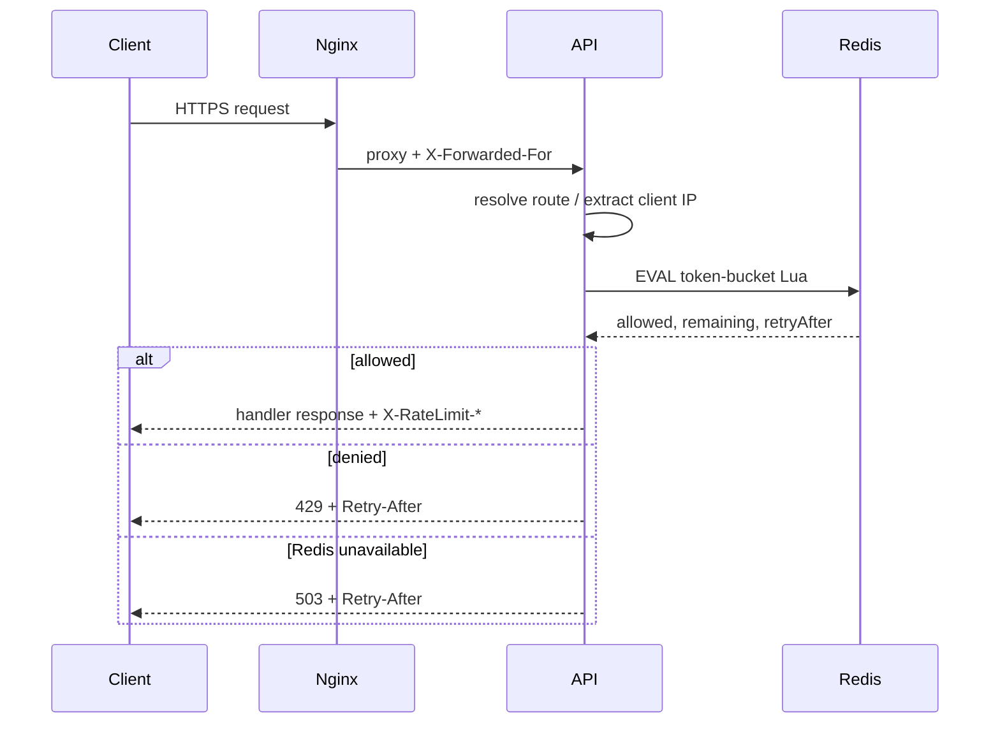
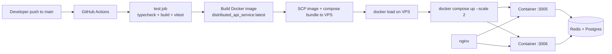

# Distributed API Service

A TypeScript Express service designed and implemented as a **multi-instance API** with:

1. **Shared distributed rate limiting** (Redis + atomic Lua token bucket)
2. **Async webhooks** (BullMQ + retries)
3. **Supporting API surfaces** (URL shortener, users CRUD)
4. **CI/CD deployment** to a VPS behind **nginx** (`https://api.gerimujo.com`)

This project is both a **systems design case study** and a **working implementation**.

**Live demo:** [https://api.gerimujo.com](https://api.gerimujo.com)

**Base URL:** `https://api.gerimujo.com` (production) · `http://localhost:3000` (local)

---

## API documentation

All routes below (except `/health`) are rate-limited: **10 requests / 60 seconds** per client IP + route + method.

Common headers on limited responses:

```http
X-RateLimit-Limit: 10
X-RateLimit-Remaining: 9
Retry-After: 6   # on 429 / 503
```

| Status | Meaning |
| --- | --- |
| `429` | Rate limit exceeded |
| `503` | Rate limiter unavailable (Redis down, fail-closed) |
| `400` | Validation error |
| `404` | Resource not found |
| `409` | Conflict (e.g. duplicate short URL) |

Error body shape:

```json
{ "error": "message" }
```

### Quick reference

| Method | Path | Auth | Description |
| --- | --- | --- | --- |
| `GET` | `/health` | No | Liveness (not rate-limited) |
| `GET` | `/rate-limiter/token-bucket` | No | Rate-limit demo |
| `POST` | `/urls` | No | Create short URL |
| `GET` | `/shorturl/:shortUrl` | No | Redirect to long URL (`308`) |
| `GET` | `/users` | No | List users (+ trigger webhooks for `GET`) |
| `GET` | `/users/:id` | No | Get user by id |
| `POST` | `/users` | No | Create user (+ webhook `user.created`) |
| `PUT` | `/users/:id` | No | Update user (+ webhook `user.updated`) |
| `DELETE` | `/users/:id` | No | Delete user (+ webhook `user.deleted`) |
| `POST` | `/webhooks` | No | Register webhook callback |
| `POST` | `/webhooks/handlers/ok` | No | Demo receiver — always `200` |
| `POST` | `/webhooks/handlers/fail` | No | Demo receiver — always `500` (retry testing) |

---

### Health

#### `GET /health`

Liveness / process metadata. **Exempt from rate limiting** (safe for nginx probes).

```bash
curl https://api.gerimujo.com/health
```

**200**

```json
{
  "status": "ok",
  "service": "app",
  "framework": "express",
  "environment": "production",
  "uptimeSeconds": 12.34,
  "timestamp": "2026-07-21T15:00:00.000Z"
}
```

---

### Rate limiter demo

#### `GET /rate-limiter/token-bucket`

Protected by the shared Redis token bucket. Use this to observe allow / deny behavior.

```bash
curl -i https://api.gerimujo.com/rate-limiter/token-bucket
```

**200**

```json
{
  "ip": "203.0.113.10",
  "service": "rate-limiter",
  "framework": "express",
  "algorithm": "token-bucket",
  "route": "/rate-limiter/token-bucket",
  "message": "Request allowed by token-bucket rate limiter.",
  "status": "ok"
}
```

**429** (after the bucket is empty)

```json
{ "error": "Rate limit exceeded." }
```

Prove shared quota across both replicas (via nginx):

```bash
bash scripts/demo-shared-limit.sh
```

---

### URL shortener

#### `POST /urls`

Create a short URL for a long `http`/`https` URL.

```bash
curl -s -X POST https://api.gerimujo.com/urls \
  -H "Content-Type: application/json" \
  -d '{"long_url":"https://example.com/page"}'
```

**Body**

| Field | Type | Required | Notes |
| --- | --- | --- | --- |
| `long_url` | string | Yes | Valid `http` or `https` URL |

**201**

```json
{ "shortUrl": "https://api.gerimujo.com/shorturl/MQ==" }
```

#### `GET /shorturl/:shortUrl`

Resolve and redirect to the long URL.

```bash
curl -i https://api.gerimujo.com/shorturl/MQ==
```

**308** → `Location: https://example.com/page`  
**404** if the short code does not exist.

---

### Users

User writes/reads can enqueue webhooks for matching registered methods.

#### `GET /users`

```bash
curl https://api.gerimujo.com/users
```

**200** — array of users.

#### `GET /users/:id`

```bash
curl https://api.gerimujo.com/users/1
```

**200** — single user · **404** if missing.

#### `POST /users`

```bash
curl -s -X POST https://api.gerimujo.com/users \
  -H "Content-Type: application/json" \
  -d '{"name":"Ada","phone_number":"+15551234567"}'
```

**Body**

| Field | Type | Required |
| --- | --- | --- |
| `name` | string | Yes |
| `phone_number` | string | Yes |

**201**

```json
{
  "id": 1,
  "name": "Ada",
  "phone_number": "+15551234567"
}
```

Triggers webhook event `user.created` for subscriptions that include `POST`.

#### `PUT /users/:id`

```bash
curl -s -X PUT https://api.gerimujo.com/users/1 \
  -H "Content-Type: application/json" \
  -d '{"name":"Ada Lovelace","phone_number":"+15551234567"}'
```

Same body as create. **200** on success · triggers `user.updated` for `PUT` subscribers.

#### `DELETE /users/:id`

```bash
curl -s -X DELETE https://api.gerimujo.com/users/1
```

**200** — deleted user payload · triggers `user.deleted` for `DELETE` subscribers.

---

### Webhooks

#### `POST /webhooks`

Register a callback URL that should receive events for selected HTTP methods.

```bash
curl -s -X POST https://api.gerimujo.com/webhooks \
  -H "Content-Type: application/json" \
  -d '{
    "url":"https://api.gerimujo.com/webhooks/handlers/ok",
    "methods":["POST","PUT","DELETE"]
  }'
```

**Body**

| Field | Type | Required | Notes |
| --- | --- | --- | --- |
| `url` | string | Yes | Valid `http`/`https` callback |
| `methods` | string[] | Yes | One or more of `GET`, `POST`, `PUT`, `PATCH`, `DELETE`, `HEAD`, `OPTIONS` |

**201**

```json
{
  "id": 1,
  "url": "https://api.gerimujo.com/webhooks/handlers/ok",
  "methods": ["POST", "PUT", "DELETE"]
}
```

When a matching user operation happens, the worker POSTs a payload like:

```json
{
  "event": "user.created",
  "method": "POST",
  "data": { "id": 1, "name": "Ada", "phone_number": "+15551234567" }
}
```

Delivery uses BullMQ (up to **10** attempts, **10s** fixed backoff).

#### Demo receivers (for local / live testing)

```bash
# Always succeeds
curl -s -X POST https://api.gerimujo.com/webhooks/handlers/ok \
  -H "Content-Type: application/json" \
  -d '{"ping":true}'

# Always fails with 500 — useful to observe retries
curl -s -X POST https://api.gerimujo.com/webhooks/handlers/fail \
  -H "Content-Type: application/json" \
  -d '{"ping":true}'
```

**Suggested walkthrough**

1. Register a webhook pointing at `/webhooks/handlers/ok` for `POST`.
2. `POST /users` to create a user.
3. Check API logs / worker output for successful delivery.
4. Re-register pointing at `/webhooks/handlers/fail` to see retry behavior.

---

## Table of contents

1. [API documentation](#api-documentation)
2. [What is implemented](#1-what-is-implemented)
3. [Problems that can occur](#2-problems-that-can-occur)
4. [How they are solved + architecture](#3-how-they-are-solved--architecture)
5. [Tests + VPS deployment](#4-tests--vps-deployment)
6. [Coming soon](#5-coming-soon-monitoring--logs)
7. [Run locally](#run-locally)

---

## 1. What is implemented

### Step A — Distributed rate limiting

Every registered API route goes through global middleware `apiRateLimit`.

| Piece | Role |
| --- | --- |
| Token bucket | Burst up to capacity, then steady refill |
| Redis key | `rate-limit-ip:{route}:{method}:{ip}` |
| Lua `EVAL` | Atomic refill + consume + persist |
| Redis `TIME` | Refill clock (no app clock skew) |
| Fail-closed | Redis down → **503** (not silent allow) |
| Trust proxy | Behind nginx, limits key on real client IP |
| Exemptions | `/health` and `/metrics` never consume quota |

**Default policy:** 10 requests / 60 seconds per IP + route + method.

**Demo endpoint:**

```bash
curl -i https://api.gerimujo.com/rate-limiter/token-bucket
```

Repeat quickly (>10 times) → expect **429** with `Retry-After`.

### Step B — Async webhooks

| Piece | Role |
| --- | --- |
| `POST /webhooks` | Register callback URL + HTTP methods |
| User mutations | Trigger webhook jobs (`user.created`, etc.) |
| BullMQ queue | Persist delivery jobs in Redis (TCP) |
| Worker | `POST` payload to callback URL |
| Retries | Up to 10 attempts, fixed 10s backoff |
| Demo handlers | `/webhooks/handlers/ok` (200) and `/fail` (500) |

Flow:

1. Client registers a webhook URL for methods like `POST`.
2. A user is created/updated/deleted.
3. The API enqueues one job per matching webhook.
4. The worker delivers the payload asynchronously (API response is not blocked by remote latency, beyond enqueue).

### Step C — Supporting API surfaces

| Area | Endpoints |
| --- | --- |
| Health | `GET /health` |
| Rate-limit demo | `GET /rate-limiter/token-bucket` |
| URLs | `POST /urls`, `GET /shorturl/:shortUrl` |
| Users | CRUD on `/users` |
| Webhooks | Register + demo ok/fail handlers |

All of the above (except health/metrics exemptions) share the same rate-limit middleware.

---

## 2. Problems that can occur

These are the distributed-systems failure modes this project was designed around.

| # | Problem | What goes wrong |
| --- | --- | --- |
| 1 | **Multi-instance drift** | Each replica keeps a local counter → N replicas ≈ N× the intended quota |
| 2 | **Read-modify-write races** | Concurrent `GET` → decide → `SET` lets several requests pass before any write lands |
| 3 | **Clock skew** | App instances use different clocks → refill math disagrees across replicas |
| 4 | **Wrong client identity behind LB** | Without `trust proxy`, all clients share the nginx IP → one noisy client blocks everyone, or quotas are wrong |
| 5 | **Redis outage** | If the limiter fails open, traffic bypasses protection entirely |
| 6 | **Health probe death spiral** | Rate-limiting `/health` makes load balancers mark healthy instances as down |
| 7 | **Webhook delivery failures** | Remote endpoints return 5xx / time out → events are lost if delivery is sync-only and best-effort |
| 8 | **Burst vs sustained traffic** | Fixed windows allow edge bursts; naive counters feel either too strict or too loose |

---

## 3. How they are solved + architecture

### Solutions map

| Problem | Solution in this project |
| --- | --- |
| Multi-instance drift | Single Redis key per client; all replicas share Upstash-compatible Redis |
| RMW races | One Lua script does refill + consume + persist atomically |
| Clock skew | Lua uses `redis.call("TIME")` instead of app `Date.now()` |
| Wrong IP behind LB | `TRUST_PROXY=1` + `getClientIp()` from Express `request.ip` / `X-Forwarded-For` |
| Redis outage | Fail-closed → **503** + `Retry-After` |
| Probe starvation | `/health` and `/metrics` exempt from rate limiting |
| Webhook failures | BullMQ jobs with retries/backoff; failed jobs retained |
| Burst vs sustained | Token bucket (capacity + steady refill) |

### High-level architecture



### Explanation

1. **nginx** terminates TLS and load-balances to two containers on ports **3005** and **3006**.
2. Each request hits **`apiRateLimit`** before the route handler.
3. The limiter runs a **Lua token-bucket script** through Redis (REST via `redis-http` locally/on VPS compose; same script semantics as Upstash).
4. Allowed requests continue to handlers (URLs, users, webhooks, demo route).
5. User events enqueue **BullMQ** jobs; the worker delivers webhooks with retries.
6. Postgres stores URLs, users, and webhook registrations.

### Rate-limit request path



### Production nginx pattern (on VPS)

Example config (kept in-repo as documentation of the live setup):

```nginx
upstream distributed_api {
    server 127.0.0.1:3005;
    server 127.0.0.1:3006;
}

server {
    listen 443 ssl http2;
    server_name api.gerimujo.com;

    location / {
        proxy_pass http://distributed_api;
        proxy_http_version 1.1;
        proxy_set_header Host $host;
        proxy_set_header X-Real-IP $remote_addr;
        proxy_set_header X-Forwarded-For $proxy_add_x_forwarded_for;
        proxy_set_header X-Forwarded-Proto $scheme;
    }
}
```

See [`deploy/nginx.conf.example`](deploy/nginx.conf.example).

### Prove shared quota through nginx

```bash
for i in $(seq 1 15); do
  curl -s -o /dev/null -w "%{http_code}\n" \
    https://api.gerimujo.com/rate-limiter/token-bucket
done
```

Expected with default limits: about **10× `200`**, then **`429`** — even though nginx fans out across two replicas.

Or run:

```bash
bash scripts/demo-shared-limit.sh
```

---

## 4. Tests + VPS deployment

### Test coverage

Vitest covers the distributed claims:

| Layer | Files | What it proves |
| --- | --- | --- |
| **Unit** | fail-closed, headers, route resolve, config, client IP | 503 on Redis failure, 429 mapping, `/health` exempt, `trust proxy` IP parsing |
| **Integration (Lua)** | `token-bucket-lua.test.ts` | Refill math, deny at empty, corrupt JSON, Redis `TIME` |
| **Integration (concurrency)** | `token-bucket-concurrency.test.ts` | 20 parallel requests → at most capacity allowed |
| **Integration (HTTP)** | `rate-limit-http.test.ts` | End-to-end middleware + separate quotas per `X-Forwarded-For` |

```bash
docker compose up -d redis
npm test
```

CI runs typecheck, build, and the full suite on every push/PR.

Webhook coverage includes schema validation, registration HTTP routes, demo ok/fail handlers, job enqueueing via `triggerWebhooks`, and delivery success/failure behavior.

### Deployment architecture (VPS)



### Deploy steps (what CI does)

1. Run tests on GitHub-hosted runner (with Redis service).
2. Build `distributed_api_service:latest`.
3. Save image as gzipped tar + package compose files.
4. Copy artifacts to the VPS over SSH/SCP.
5. `docker load` the image.
6. `docker compose up -d --scale distributed_api_service=2`.
7. nginx (configured on the server) routes `api.gerimujo.com` → `3005`/`3006`.

Compose stack includes:

- 2× API replicas  
- Redis + Redis HTTP proxy (rate-limit EVAL)  
- Postgres  
- Shared env via VPS `.env`

### Local build (same image CI deploys)

```bash
docker build -t distributed_api_service:latest .
docker compose up -d
```

---

## 5. Coming soon: monitoring & logs

**Not implemented yet** — planned next:

- Structured request logs (allow / deny / 503 decisions)
- Prometheus metrics (`allowed`, `denied`, `unavailable`, check latency)
- `GET /metrics` (already reserved / exempt from rate limiting)
- Readiness probe that checks Redis (`/health/ready`)

These will make quota pressure and Redis failures observable in production.

---

## Run locally

### Prerequisites

- Node.js 22+
- Docker / Docker Compose

### Environment

```bash
cp .env.example .env
```

### Start dependencies + app image

```bash
docker compose up -d redis redis-http db
npm install
npm run dev
```

Or full stack with two replicas (after building the image):

```bash
docker build -t distributed_api_service:latest .
docker compose up -d
```

### Scripts

| Script | Description |
| --- | --- |
| `npm run dev` | Dev server with reload |
| `npm run build` | Compile TypeScript |
| `npm run typecheck` | Typecheck only |
| `npm test` | Unit + integration tests |
| `npm run test:unit` | Unit only |
| `npm run test:integration` | Needs local Redis |

### Quick checks

```bash
curl http://localhost:3000/health
curl http://localhost:3000/rate-limiter/token-bucket
curl -i https://api.gerimujo.com/rate-limiter/token-bucket
```

---

## Tech stack

Express 5 · TypeScript · Redis (Lua token bucket) · PostgreSQL · BullMQ · Zod · Vitest · Docker · GitHub Actions · nginx (VPS)
