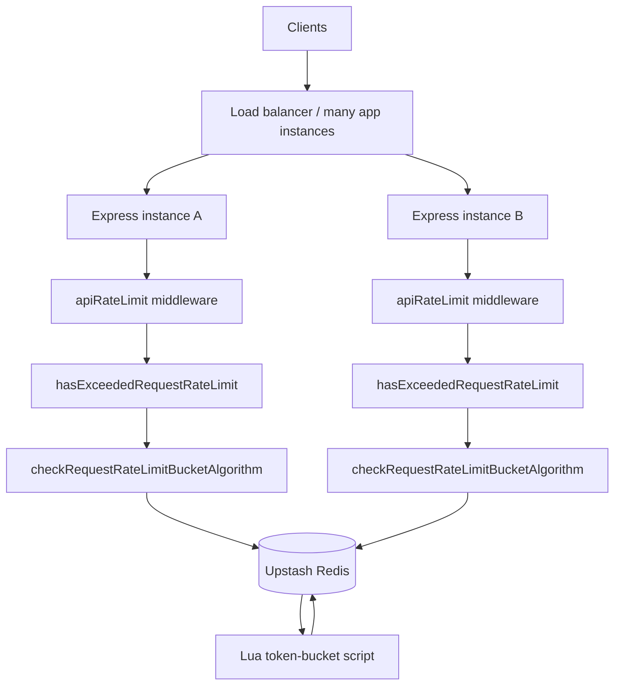
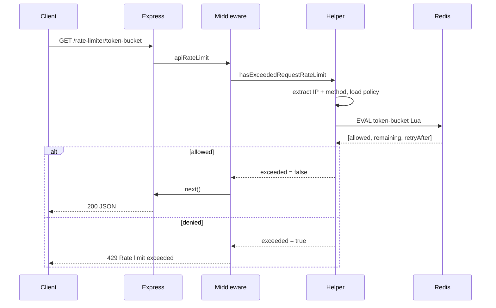

# Distributed Rate Limiter

A TypeScript Express service that enforces **shared, consistent rate limits across multiple application instances** using a **token-bucket algorithm** stored in **Upstash Redis**.

In a distributed system, each API replica would otherwise keep its own in-memory counters. That fails under load: clients can multiply their effective quota by hitting different instances, and concurrent requests race on read-modify-write. This project solves that by keeping a single source of truth in Redis and updating it atomically with a Lua script.

---

## What problem this solves

| Problem | What goes wrong without a shared limiter | How this project addresses it |
| --- | --- | --- |
| **Multi-instance drift** | N replicas × local limit ≈ N× the intended quota | All instances read/write the same Redis key per client |
| **Race conditions** | Concurrent `GET` → decide → `SET` lets several requests pass before any write lands | Refill, consume, and persist run inside **one Redis Lua script** (`EVAL`) |
| **Burst vs sustained rate** | Fixed windows allow edge bursts; naive counters feel either too strict or too loose | **Token bucket**: allow short bursts up to capacity, then refill at a steady rate |
| **Inconsistent decisions** | Two servers can disagree on remaining quota | Redis is the authority; the app only interprets `allowed` / denied |

This is a **demo / reference implementation** of that pattern for `GET /rate-limiter/token-bucket`, not a full gateway product.

---

## How it works

### Token bucket (concept)

Each client (keyed by IP + route + HTTP method) owns a bucket:

- **Capacity** (`maxRequests`) — maximum tokens held at once (burst size).
- **Refill period** (`timeWindowSeconds`) — time to regenerate a full bucket.
- **Cost** — each allowed request consumes **1** token.

Example with the default config (`10` requests / `60` seconds):

- Bucket starts full (10 tokens).
- One token is restored every `60 / 10 = 6` seconds.
- Up to 10 requests can succeed immediately; further requests are denied until tokens refill.

### Atomic execution (implementation)

The Node process does **not** load the bucket, change it, and write it back in separate Redis commands. That would race under concurrency.

Instead, `executeRateLimitScript` runs a Lua script via Upstash `EVAL` that, in one atomic step:

1. Loads the bucket JSON (or creates a full bucket).
2. Refills whole tokens based on elapsed time since `lastRefillTimestamp`.
3. Consumes a token if enough remain (`allowed = 1`), otherwise denies (`allowed = 0`).
4. Persists the updated `{ tokenCount, lastRefillTimestamp }`.
5. Returns `[allowed, remainingTokens, retryAfterSeconds]`.

Because Redis runs Lua serially per script, concurrent requests from many app instances cannot interleave mid-update.

### Limit configuration

Limits live in `src/conf/rate-limiting/bucket-algorithm.ts`:

```ts
rateLimit: { maxRequests: 10, timeWindowSeconds: 60 }
```

Policies are keyed by **route** and **HTTP method**. The Redis key is:

```text
rate-limit-ip:{route}:{method}:{ip}
```

Example: `rate-limit-ip::/token-bucket:GET:127.0.0.1`

Change `maxRequests` / `timeWindowSeconds` in that config file to tune capacity and refill speed.

---

## Architecture



### Layer responsibilities

| Layer | Location | Role |
| --- | --- | --- |
| Boot | `src/index.ts`, `src/config.ts` | Load env, start Express, log routes |
| HTTP | `src/express-server.ts`, `src/routes/` | Mount `/health` and `/rate-limiter/*` |
| Middleware | `src/middleware/rate-limiter/` | Run the check before the handler; map errors to HTTP |
| Domain helpers | `src/helpers/rate-limiter/` | Pick algorithm, build Redis key, interpret allow/deny |
| Config | `src/conf/rate-limiting/` | Per-route / per-method limits |
| Infrastructure | `src/lib/redis.ts`, `src/lib/scripts/` | Upstash client + Lua script |

### Request path (happy / denied)



1. Router matches `GET /rate-limiter/token-bucket`.
2. `apiRateLimit` calls `hasExceededRequestRateLimit` with the token-bucket algorithm.
3. Helper resolves policy (`maxRequests`, `timeWindowSeconds`) and builds the Redis key.
4. Lua script atomically refills/consumes and returns whether the request is allowed.
5. Middleware calls `next()` on allow, or responds with **429** on deny.

---

## API

| Method | Path | Description |
| --- | --- | --- |
| `GET` | `/health` | Liveness / process metadata |
| `GET` | `/rate-limiter/token-bucket` | Demo endpoint protected by the token bucket |

**Allowed (200):**

```json
{
  "ip": "127.0.0.1",
  "service": "rate-limiter",
  "framework": "express",
  "algorithm": "token-bucket",
  "route": "/rate-limiter/token-bucket",
  "message": "Request allowed by token-bucket rate limiter.",
  "status": "ok"
}
```

**Denied (429):**

```json
{
  "error": "Rate limit exceeded."
}
```

With the default config, a single IP can get **10** successful responses within a short burst; further calls return **429** until tokens refill.

---

## Project layout

```text
src/
  conf/                 # Routes and rate-limit policies
  routes/               # Express routers
  middleware/           # Rate-limit gate before handlers
  helpers/rate-limiter/ # Algorithm orchestration
  lib/
    redis.ts            # Upstash client + EVAL wrapper
    scripts/            # Lua token-bucket script
  utils/                # Request extraction and errors
  types/                # Shared TypeScript types
```

---

## Prerequisites

- Node.js **22+**
- npm
- An [Upstash Redis](https://upstash.com/) database (REST URL + token)

## Environment

Create a `.env` in the project root:

```env
PORT=3000
NODE_ENV=development
UPSTASH_REDIS_REST_URL=https://....upstash.io
UPSTASH_REDIS_REST_TOKEN=...
```

| Variable | Required | Description |
| --- | --- | --- |
| `UPSTASH_REDIS_REST_URL` | Yes | Upstash Redis REST URL |
| `UPSTASH_REDIS_REST_TOKEN` | Yes | Upstash REST token |
| `PORT` | No | Listen port (default `3000`) |
| `NODE_ENV` | No | Exposed on `/health` (default `development`) |

The Redis client is created at import time. Missing Upstash credentials prevent the server from starting.

## Run

```bash
npm install
npm run dev
```

| Script | Description |
| --- | --- |
| `npm run dev` | Dev server with reload (`tsx watch`) |
| `npm run build` | Compile TypeScript to `dist/` |
| `npm run typecheck` | Typecheck without emit |
| `npm run start` | Run with `tsx` |

On boot you should see:

```text
Server listening on http://localhost:3000 using express
Registered routes:
GET /health
GET /rate-limiter/token-bucket
```

Quick check:

```bash
curl http://localhost:3000/health
curl http://localhost:3000/rate-limiter/token-bucket
```

Repeat the second call more than `maxRequests` times quickly to observe **429** responses.

---

## Design notes

- **Shared state in Redis** is what makes the limit correct across horizontally scaled instances.
- **Lua atomicity** is what makes the limit correct under concurrent requests.
- **Token bucket** is what makes the limit usable: bursts up to capacity, then a predictable refill rate.
- Limits are currently **per IP** (plus route and method). Extending to API keys or user IDs means changing how the Redis key is built.
- Bucket keys are stored without TTL; inactive keys remain until deleted. Adding expiry is a natural follow-up for production use.
