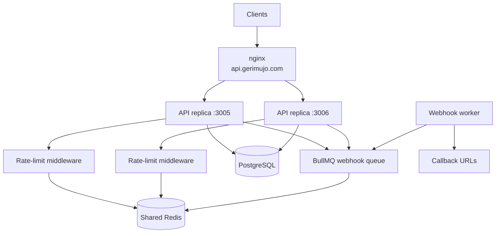
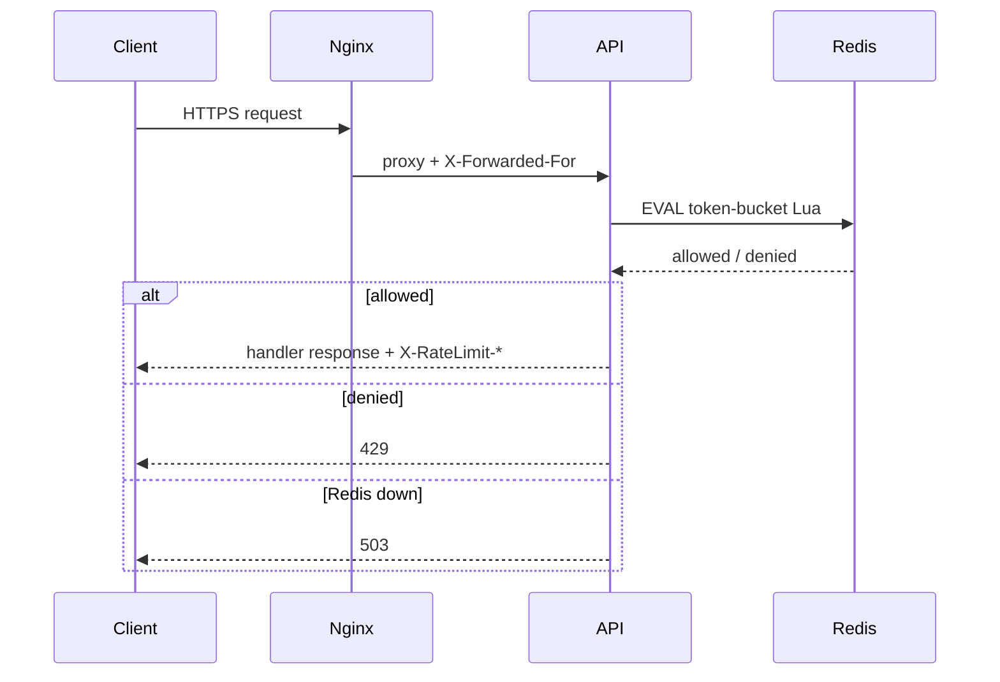
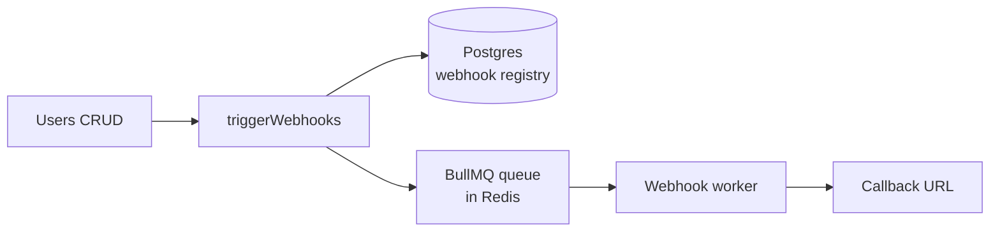
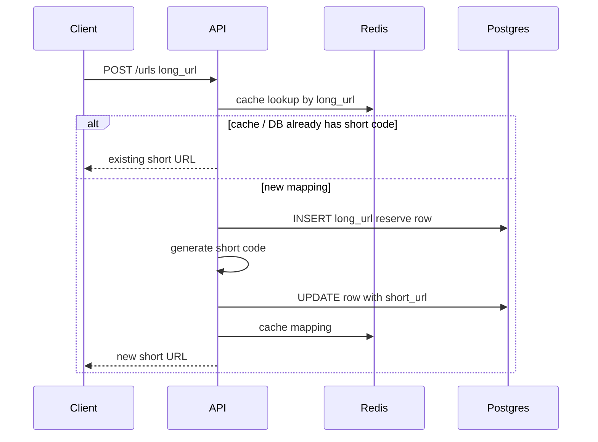
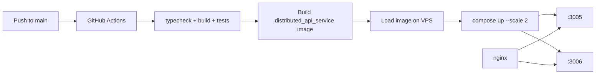

# Distributed API Service

A TypeScript Express service designed and implemented as a **multi-instance API** behind nginx (`https://api.gerimujo.com`).

This project is both a **systems design case study** and a **working implementation**.

**Live demo:** [https://api.gerimujo.com](https://api.gerimujo.com)  
**Base URL:** `https://api.gerimujo.com` (production) · `http://localhost:3000` (local)

---

## Table of contents

1. [What is implemented](#1-what-is-implemented)
2. [How each feature is implemented](#2-how-each-feature-is-implemented)
3. [API documentation](#3-api-documentation)
4. [Tests + VPS deployment](#4-tests--vps-deployment)
5. [Coming soon](#5-coming-soon-monitoring--logs)
6. [Run locally](#run-locally)

---

## 1. What is implemented

This service implements three main capabilities, plus deployment:

| # | Feature | What it does |
| --- | --- | --- |
| 1 | **Distributed rate limiter** | Shared per-client quotas across multiple API replicas using Redis + a token-bucket algorithm |
| 2 | **Async webhooks** | Register callbacks and deliver event payloads through a BullMQ job queue with retries. **Users CRUD is the event source** that triggers those webhooks (create / update / delete / read) |
| 3 | **URL shortener** | Create short links, persist them in Postgres, cache lookups in Redis, and redirect |
| — | **VPS deployment** | Two Docker replicas behind nginx, shipped by GitHub Actions CI/CD |

---

## 2. How each feature is implemented

Below is **design-level** explanation: the problems each feature faces, and how this project solves them (not line-by-line code).

### Overall architecture



Two API instances sit behind nginx and share the **same Redis** and **same Postgres**. That shared infrastructure is what makes the rate limiter and queues correct in a distributed setup.

---

### 2.1 Distributed rate limiter

#### Problems we solved

| Problem | What goes wrong without a shared design |
| --- | --- |
| **Multi-instance drift** | Each replica keeps its own counter → N replicas ≈ N× the intended quota |
| **Concurrency / RMW races** | Concurrent `GET` → decide → `SET` lets several requests pass before any write lands |
| **Burst vs sustained traffic** | Fixed windows feel too loose at edges, or too strict for short bursts |
| **Clock skew** | Different app clocks disagree on refill time |
| **Wrong client IP behind LB** | All traffic looks like nginx’s IP → one client can exhaust everyone’s quota (or quotas never isolate correctly) |
| **Redis outage** | If the limiter fails open, protection disappears silently |
| **Probe death spiral** | Rate-limiting `/health` makes the load balancer mark healthy instances as down |

#### How it is implemented

1. **Shared Redis across replicas**  
   Every API instance talks to the **same Redis database**. The quota for a client is one key, not one key per process. Scaling out API replicas does not multiply the limit.

2. **Token bucket algorithm**  
   Each client (IP + route + method) owns a bucket with capacity (burst) and a refill period (sustained rate). Default: **10 requests / 60 seconds**.

3. **Lua script for atomicity**  
   Refill, consume, and save happen inside **one Redis Lua `EVAL`**. Redis runs that script atomically, so concurrent requests from both replicas cannot interleave mid-update. That is the fix for read-modify-write races.

4. **Redis `TIME` as the clock**  
   The script uses Redis server time, not each app’s `Date.now()`, so refill math stays consistent across instances.

5. **Fail-closed behavior**  
   If Redis cannot answer, the API returns **503** (with `Retry-After`) instead of allowing traffic through.

6. **Trust proxy + real client IP**  
   Behind nginx, `TRUST_PROXY=1` makes rate-limit keys use `X-Forwarded-For` / Express `request.ip`, so each end user gets their own quota.

7. **Exempt probes**  
   `/health` and `/metrics` skip the limiter so nginx health checks never burn quota or get 429’d.



---

### 2.2 Async webhooks (with Users CRUD as the trigger)

Users CRUD is **not a separate product feature** here. It exists so the webhook pipeline has real domain events to deliver.

#### Problems we solved

| Problem | What goes wrong |
| --- | --- |
| **Slow or failing callbacks** | If the API waits on a remote webhook, user requests become slow or fail when the callback is down |
| **Lost events** | A single failed HTTP POST can drop the event forever |
| **Duplicate registrations / fan-out** | Many subscribers may need the same event delivered independently |
| **Nothing to notify about** | Without a concrete domain API, webhooks are only theoretical |

#### How it is implemented

1. **Users CRUD = event source**  
   `GET` / `POST` / `PUT` / `DELETE` on `/users` perform normal CRUD **and** call `triggerWebhooks` with events such as `user.created`, `user.updated`, `user.deleted` (and read events for `GET` when subscribed).

2. **Registration**  
   Clients call `POST /webhooks` with a callback URL and the HTTP methods they care about (`POST`, `PUT`, `DELETE`, …). Registrations live in **Postgres**.

3. **Match method → enqueue**  
   After a user operation, the API looks up webhooks whose `methods` include that HTTP method and enqueues one BullMQ job per match.

4. **BullMQ job queue**  
   Jobs are stored in **Redis**. The users API returns after enqueue; delivery happens **asynchronously** in a worker (the user request is not blocked on the remote callback succeeding).

5. **Worker delivery**  
   The worker POSTs `{ event, method, data }` to each callback URL (`data` is the user payload).

6. **Retries**  
   Failed deliveries retry (up to **10** attempts, **10s** fixed backoff). Failed jobs are kept for inspection. Demo endpoints `/webhooks/handlers/ok` and `/fail` make success vs retry behavior easy to observe.



---

### 2.3 URL shortener

#### Problems we solved

| Problem | What goes wrong |
| --- | --- |
| **Duplicate long URLs** | Two concurrent creates for the same long URL can invent two different short codes |
| **Partial writes** | Generating a code before the row exists (or updating without a reserved row) races under concurrency |
| **Hot redirect path** | Every redirect hitting Postgres only is slower than necessary under load |

#### How it is implemented

1. **Reserve the row first**  
   On create, the service **inserts the long URL into Postgres first** (`ON CONFLICT DO NOTHING` on `long_url`). That reserves / reuses the unique row before committing to a short code.

2. **Then update with the generated code**  
   After a short code is generated, the service **updates that reserved row** with `short_url`. If the long URL already had a short code, that existing mapping is returned instead of creating another.

3. **Idempotent create path**  
   Unique constraints on `long_url` (and `short_url`) prevent duplicate mappings when concurrent requests race.

4. **Redis cache for reads**  
   Lookups by long URL and by short code are cached in Redis (with TTL) so redirects and repeat creates avoid always going to Postgres first.



---

## 3. API documentation

All routes below (except `/health`) are rate-limited: **10 requests / 60 seconds** per client IP + route + method.

Common headers on limited responses:

```http
X-RateLimit-Limit: 10
X-RateLimit-Remaining: 9
Retry-After: 6   # on 429 / 503
```

| Status | Meaning |
| --- | --- |
| `429` | Rate limit exceeded |
| `503` | Rate limiter unavailable (Redis down, fail-closed) |
| `400` | Validation error |
| `404` | Resource not found |
| `409` | Conflict (e.g. duplicate short URL) |

Error body shape:

```json
{ "error": "message" }
```

### Quick reference

| Method | Path | Description |
| --- | --- | --- |
| `GET` | `/health` | Liveness (not rate-limited) |
| `GET` | `/rate-limiter/token-bucket` | Rate-limit demo |
| `POST` | `/urls` | Create short URL |
| `GET` | `/shorturl/:shortUrl` | Redirect to long URL (`308`) |
| `GET` | `/users` | List users |
| `GET` | `/users/:id` | Get user by id |
| `POST` | `/users` | Create user (+ webhook `user.created`) |
| `PUT` | `/users/:id` | Update user (+ webhook `user.updated`) |
| `DELETE` | `/users/:id` | Delete user (+ webhook `user.deleted`) |
| `POST` | `/webhooks` | Register webhook callback |
| `POST` | `/webhooks/handlers/ok` | Demo receiver — always `200` |
| `POST` | `/webhooks/handlers/fail` | Demo receiver — always `500` (retry testing) |

---

### Health

#### `GET /health`

```bash
curl https://api.gerimujo.com/health
```

**200**

```json
{
  "status": "ok",
  "service": "app",
  "framework": "express",
  "environment": "production",
  "uptimeSeconds": 12.34,
  "timestamp": "2026-07-21T15:00:00.000Z"
}
```

---

### Rate limiter demo

#### `GET /rate-limiter/token-bucket`

```bash
curl -i https://api.gerimujo.com/rate-limiter/token-bucket
```

**200**

```json
{
  "ip": "203.0.113.10",
  "service": "rate-limiter",
  "framework": "express",
  "algorithm": "token-bucket",
  "route": "/rate-limiter/token-bucket",
  "message": "Request allowed by token-bucket rate limiter.",
  "status": "ok"
}
```

**429** after the bucket is empty:

```json
{ "error": "Rate limit exceeded." }
```

Prove shared quota across both replicas (via nginx):

```bash
bash scripts/demo-shared-limit.sh
```

---

### URL shortener

#### `POST /urls`

```bash
curl -s -X POST https://api.gerimujo.com/urls \
  -H "Content-Type: application/json" \
  -d '{"long_url":"https://example.com/page"}'
```

| Field | Type | Required | Notes |
| --- | --- | --- | --- |
| `long_url` | string | Yes | Valid `http` or `https` URL |

**201**

```json
{ "shortUrl": "https://api.gerimujo.com/shorturl/MQ==" }
```

#### `GET /shorturl/:shortUrl`

```bash
curl -i https://api.gerimujo.com/shorturl/MQ==
```

**308** → `Location: https://example.com/page`  
**404** if missing.

---

### Users (webhook event source)

Users CRUD feeds the webhook system. Each operation can enqueue deliveries for subscribers that registered the matching HTTP method.

#### `GET /users` / `GET /users/:id`

```bash
curl https://api.gerimujo.com/users
curl https://api.gerimujo.com/users/1
```

#### `POST /users`

```bash
curl -s -X POST https://api.gerimujo.com/users \
  -H "Content-Type: application/json" \
  -d '{"name":"Ada","phone_number":"+15551234567"}'
```

| Field | Type | Required |
| --- | --- | --- |
| `name` | string | Yes |
| `phone_number` | string | Yes |

Triggers webhook event `user.created` for subscribers that include `POST`.

#### `PUT /users/:id` / `DELETE /users/:id`

Same body as create for `PUT`. Triggers `user.updated` / `user.deleted` for matching method subscriptions.

---

### Webhooks

#### `POST /webhooks`

```bash
curl -s -X POST https://api.gerimujo.com/webhooks \
  -H "Content-Type: application/json" \
  -d '{
    "url":"https://api.gerimujo.com/webhooks/handlers/ok",
    "methods":["POST","PUT","DELETE"]
  }'
```

| Field | Type | Required | Notes |
| --- | --- | --- | --- |
| `url` | string | Yes | Callback `http`/`https` URL |
| `methods` | string[] | Yes | e.g. `GET`, `POST`, `PUT`, `DELETE` |

Worker payload example:

```json
{
  "event": "user.created",
  "method": "POST",
  "data": { "id": 1, "name": "Ada", "phone_number": "+15551234567" }
}
```

#### Demo receivers

```bash
curl -s -X POST https://api.gerimujo.com/webhooks/handlers/ok \
  -H "Content-Type: application/json" \
  -d '{"ping":true}'

curl -s -X POST https://api.gerimujo.com/webhooks/handlers/fail \
  -H "Content-Type: application/json" \
  -d '{"ping":true}'
```

**Walkthrough:** register → `POST /users` → observe delivery; point at `/fail` to see retries.

---

## 4. Tests + VPS deployment

### Test coverage

| Layer | What it proves |
| --- | --- |
| **Unit (rate limit)** | Fail-closed → 503, deny → 429, route resolution, headers, trust-proxy IP, `/health` exempt |
| **Unit (webhooks)** | Schema validation, registration routes, enqueue on trigger, delivery success/failure |
| **Integration (Lua)** | Refill math, deny at empty bucket, corrupt JSON, Redis `TIME` |
| **Integration (concurrency)** | 20 parallel requests → at most capacity allowed |
| **Integration (HTTP)** | Middleware headers + separate quotas per `X-Forwarded-For` |

```bash
docker compose up -d redis
npm test
```

### Deployment architecture (VPS)



nginx example: [`deploy/nginx.conf.example`](deploy/nginx.conf.example)

---

## 5. Coming soon: monitoring & logs

**Not implemented yet** — planned next:

- Structured logs for allow / deny / 503 decisions
- Prometheus metrics (`allowed`, `denied`, `unavailable`, check latency)
- `GET /metrics` (path already reserved / exempt)
- Readiness probe that checks Redis (`/health/ready`)

---

## Run locally

```bash
cp .env.example .env
docker compose up -d redis redis-http db
npm install
npm run dev
```

| Script | Description |
| --- | --- |
| `npm run dev` | Dev server with reload |
| `npm run build` | Compile TypeScript |
| `npm test` | Unit + integration tests |

```bash
curl http://localhost:3000/health
curl http://localhost:3000/rate-limiter/token-bucket
```

---

## Tech stack

Express 5 · TypeScript · Redis (Lua token bucket) · PostgreSQL · BullMQ · Zod · Vitest · Docker · GitHub Actions · nginx (VPS)
